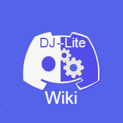

# DJ-Lite Wiki
   

This is an open-source bot and you can fully customize it!

### Thanks to these people:
- DJj123dj: Helping me learing coding JavaScript
- Everyone helping me to improve this document

## This is what we already have in our code
- Normal reply message
- Embed creation

## Quick Start
[Click here to start your adventure!](https://docs.djlite.dj-dj.be/quick-start)

## Documentation
[Official Documentation](https://docs.djlite.dj-dj.be)

## Version
_v1.0.0_

changelog: [click here](https://docs.djlite.dj-dj.be/other/changelog)

© 2022 - DJ-Lite Wiki | [Discord](https://discord.gg/PANwbcpUzu) | [Documentation](https://docs.djlite.dj-dj.be)